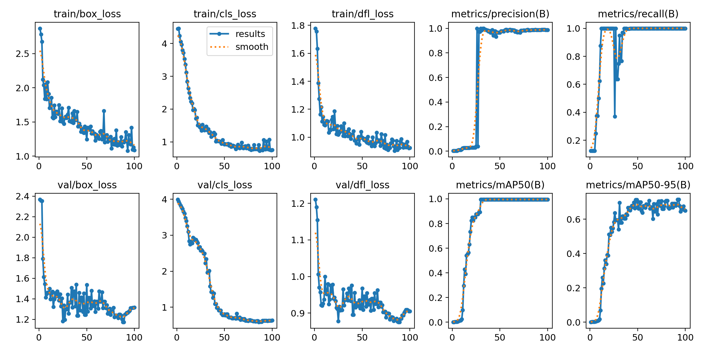

<div align="center">
  <h1>ClashVision</h1>
</div>

<div align="center">
  
  
  
</div>


<div align="center">
  
</div>

## 📖 Overview

**ClashVision** is a computer vision project that leverages advanced deep learning techniques to provide
state-of-the-art object detection like gold storage and elixir storage detection in Clash of Clans game.
Built using YOLOv8 architecture, ClashVision is designed to be efficient and accurate, making it suitable for
real-time applications.

## ✨ Features

## 🔧 Pre-requisites

- **Python 3.13+**
- **pip** or **conda**
- **uv** (package manager, optional but recommended)
- **Virtual Environment** (recommended)
- **GPU** (recommended)

See `pyproject.toml` for a complete list of dependencies.

## 🚀 Installation

1. Run commands to set up the environment and install dependencies:

```bash
./scripts/setup-env.sh
```

2. If you are using a GPU, ensure that you have the appropriate CUDA toolkit installed.

## 🧪 Code quality

### Unit Tests available

To run unit tests and ensure code quality, run the following commands:

```bash
./scripts/run-pytest.sh
```

### Linting available

Linting is done using `ruff`. To check for linting issues, run:

```bash
.scripts/run-ruff.sh
```

### Formatting available

Code formatting is done using `black`. To format the code, run:

```bash
./scripts/run-black.sh
```

## 📊 Model Summary

### Model Architecture

72 layers, 3,006,038 parameters, 0 gradients, 8.1 GFLOPs

<div align="center">
    <table>
      <thead>
        <tr>
          <th style="padding:8px 16px;">Layer</th>
          <th style="padding:8px 16px;">Parameters</th>
          <th style="padding:8px 16px;">Gradients</th>
          <th style="padding:8px 16px;">GFLOPs</th>
        </tr>
      </thead>
      <tbody align="center">
        <tr>
          <td>72</td>
            <td>3,006,038</td>
            <td>0</td>
            <td>8.1</td>
        </tr>
      </tbody>
    </table>
</div>

### Training and Validation Curves

<div align="center">
  
</div>

## 🔗 Related Projects

- [ClashVisionRuntime](https://github.com/Maxime-Cllt/ClashVisionRuntime.git)

## 🎯 Note

- This project is for educational purposes only and is not affiliated with or endorsed by Supercell, the developer of
  Clash of Clans.
- The model works fine on any screenshot of the game, but may not perform well on images with extreme angles or
  obstructions.

## 🤝 Contributing

We welcome contributions to enhance the capabilities of ClashVision.